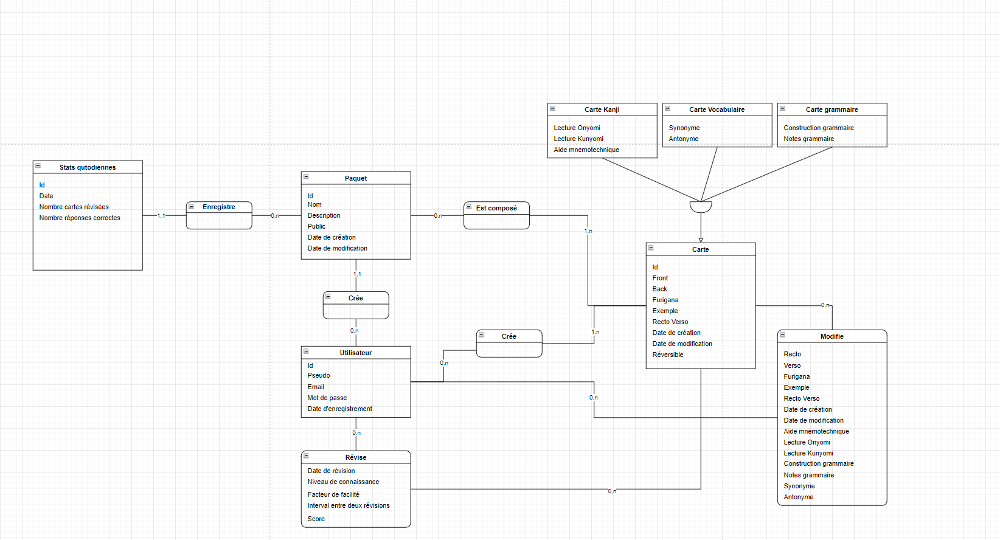
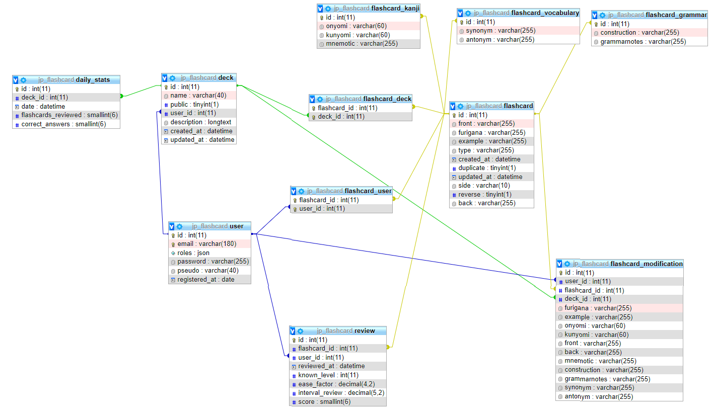

# Application JapaneseCard (front) réalisée avec Angular

## But de l'application

JapaneseCard est une application qui permet d'apprendre et de réviser la langue japonaise à l'aide d'un système de cartes mémoire (flashcards). Chaque carte comporte une question au recto et une réponse au verso. L'application utilise le système de répétition espacée pour favoriser une mémorisation efficace à long terme. Les cartes sont présentées selon un intervalle spécifique qui dépend des réponses précédentes, de la facilité à se souvenir de la réponse et du niveau de connaissance de la carte.

## Fonctionalités

### Utilisateur non connecté

- Page d'accueil
- Parcourir les paquets de cartes publics
- Créer un compte

### Utilisateur connecté

- Dupliquer les paquets de cartes publics
- Accès à un espace personnel avec les fonctionnalités suivantes :
  - Créer, modifier et supprimer des paquets de cartes
  - Créer, modifier et supprimer des cartes
  - Dupliquer un paquet public
  - Réviser les cartes d'un paquet
  - Voir les statistiques de révision

## Modèle conceptuel des données

## Modèle physique des données

## Dump de la base de données

[jp_flashcard.sql](jp_flashcard.sql)